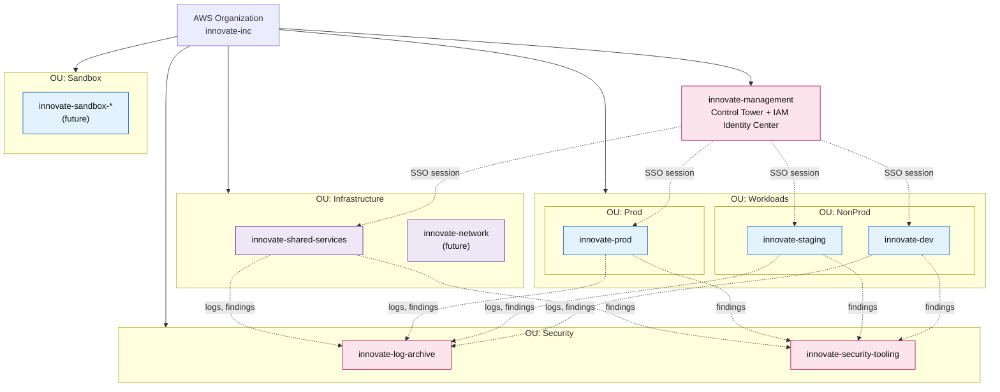
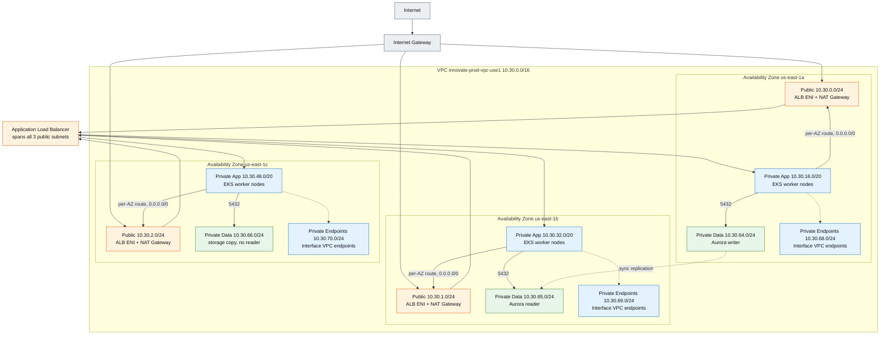

# Innovate Inc. — Cloud Architecture Design

*Amazon Web Services · Amazon EKS · Aurora PostgreSQL · three-tier architecture*

Prepared for Innovate Inc. | Version 1.0

<!-- TOC: Phase 12 -->

<!-- EXEC-SUMMARY: Phase 12 -->

## 0. Scope, Assumptions and Design Principles

This chapter sets the terms the rest of the document is checked against.

> **Well-Architected pillars.** Security · Reliability · Operational Excellence · Cost Optimization

### 0.1 Scope and objectives

This document designs Innovate Inc.'s cloud infrastructure for a Python/Flask REST API, a React
single-page application (SPA), and PostgreSQL. Four criteria drive it: growth from a few hundred daily
users to potentially millions, sensitive user data, a small team with limited cloud experience, and
continuous integration and continuous delivery (CI/CD) from day one.

We recommend Amazon Web Services (AWS) over Google Cloud Platform (GCP) — GCP demands less
day-to-day Kubernetes operation, but AWS wins on managed-service breadth, governance tooling, and
hiring pool (Appendix B, ADR-001). Managed services come first throughout: a small team's time is
scarcer than the bill, so a managed AWS service beats self-hosting wherever one exists.

### 0.2 Architecture overview — a three-tier design

Innovate Inc.'s application is a classic three-tier architecture — presentation, application, data —
each tier with a distinct relationship to the virtual private cloud (VPC). Network, compute, and
security align to the same three lines.

| Tier | Contains | Runs on | Network placement | Scales by |
|---|---|---|---|---|
| **Presentation tier** | React single-page application, static assets | Amazon S3 origin behind Amazon CloudFront, with AWS WAF at the edge | Outside the VPC entirely — served from CloudFront edge locations | CloudFront; effectively unbounded, no action required |
| **Application tier** | Python/Flask REST API, background workers | Pods on Amazon EKS | **Private — App** subnets; pod IPs from the secondary CIDR. No inbound internet route. | Horizontal Pod Autoscaler and KEDA for pods, Karpenter for nodes |
| **Data tier** | PostgreSQL, and later a cache | Aurora PostgreSQL behind Amazon RDS Proxy | **Private — Data** subnets. No internet route, inbound only from the application tier. | Aurora Serverless v2 capacity units, then read replicas |

Three properties recur: **each tier is reachable only from the tier above it**, by security-group
reference, not CIDR; **the tier boundary is also the security boundary** — one model, not four; and
**each tier scales independently, by a different mechanism**. A three-tier model, not microservices,
fits a small team's one API and one worker fleet — splitting further now buys distributed-systems
problems this team lacks headcount for; a later split happens inside this model, not as a rewrite.

### 0.3 Design principles

Seven principles every later decision is checked against.

| Principle | Meaning |
|---|---|
| Managed over self-hosted | Buy back the undifferentiated work; a small team should not run PostgreSQL failover |
| Isolate by account | The strongest boundary AWS enforces, and it costs almost nothing |
| Least privilege, mechanized | Deny-first guardrails, per-workload identities, no long-lived credentials |
| Everything as code | Terraform for infrastructure, Git for cluster state; `git log` always answers "what changed" |
| Secure and cost-aware by construction | Security and cost are properties of each decision, not chapters appended at the end |
| Start simple, leave the door open | A day-1 footprint a small team can run; no choice that blocks the 100× version |
| Design for failure, then rehearse it | Multiple Availability Zones (AZs) by default, tested restores, explicit recovery objectives |

Conflicting principles are resolved with the trade-off stated explicitly, collected in §9.7.

### 0.4 Assumptions

These assumptions protect the design from being judged against requirements the brief never stated.

1. US-based users and data residency at launch (`us-east-1`); `eu-west-1` reserved. A single
   production region suffices; cross-region is disaster recovery (DR) posture, not active-active.
2. Greenfield, no existing AWS footprint; GitHub source control (other SCMs change CI/CD detail, not
   the architecture).
3. Small, lean team, no dedicated SRE or security staff; budget roughly four figures monthly at
   launch, scaling with revenue.
4. Sensitive data means PII, no payment-card or health data; compliance target is SOC 2 readiness and
   GDPR alignment, not a certified audit.
5. Stateless application code, multiple replicas, graceful termination handling — required for Spot
   and rolling deployments.
6. No hybrid or on-premises connectivity requirement.
7. Schema changes follow an expand/contract pattern.

### 0.5 Out of scope

Deliberately excluded: application source code and schema design; end-user authentication
implementation (recommended in §5.5, not designed); marketing analytics, notifications, and mobile
clients; a data warehouse; active-active multi-region deployment; formal compliance certification, as
distinct from the readiness built toward it; and capacity testing and the Terraform implementation,
which follow from this design rather than define it.

---

## 1. Cloud Environment Structure

We start Innovate Inc.'s cloud environment as **seven AWS accounts** inside a single AWS Organization
(`innovate-inc`) managed by AWS Control Tower, in four organizational units (OUs), with two further
accounts pre-planned. Seven is where isolation, billing, and management each get a real boundary.

> **Well-Architected pillars.** Security · Reliability · Operational Excellence

### 1.1 Why multiple accounts

The account is the only AWS boundary bounding identity and access management (IAM), service quotas,
and blast radius at once; a VPC or namespace boundary inside one account still shares IAM, quotas, and
a control plane. **A compromised credential in `innovate-dev` has no path to production data** under
account separation, without anyone writing a correct IAM policy. Consolidated billing at
`innovate-management` prices production accurately without depending on tags; service control policies (SCPs) attach at the OU
level, so guardrails differ by risk; quotas are counted per account, so a runaway load test in
`innovate-dev` cannot exhaust production's headroom. The same separation buys **separation of
duties**: a full compromise of `innovate-prod` still cannot reach the log sink or disable the
findings pipeline — what a SOC 2 audit asks for. Each account pays its own ~$25–60/month baseline
(GuardDuty, Config, VPC endpoints) — why the answer is seven accounts, not twenty (Appendix B,
ADR-004).

### 1.2 Account inventory

| Account | OU | Purpose | Day 1? |
|---|---|---|---|
| `innovate-management` | Root | Organizations, Control Tower, consolidated billing, IAM Identity Center directory. **No workloads, ever.** | Yes |
| `innovate-log-archive` | Security | Immutable sink for org CloudTrail, AWS Config, VPC flow logs, ALB/CloudFront logs. S3 Object Lock (WORM). | Yes |
| `innovate-security-tooling` | Security | Delegated administrator for GuardDuty, Security Hub, Detective, Inspector, Macie, IAM Access Analyzer. Read-only cross-account roles. | Yes |
| `innovate-shared-services` | Infrastructure | ECR registry of record, CI/CD runners & OIDC roles, Route 53 public hosted zone, ACM shared certs, Terraform state backends, artifact/SBOM store. | Yes |
| `innovate-dev` | Workloads / NonProd | Development EKS cluster + Aurora. Loosest guardrails, synthetic data only. | Yes |
| `innovate-staging` | Workloads / NonProd | Pre-production mirror of prod topology at reduced size. Release candidate gate. **No production data.** | Yes |
| `innovate-prod` | Workloads / Prod | Production only. Tightest SCPs, change-controlled, break-glass access. | Yes |

Two more accounts are pre-planned: `innovate-sandbox-<user>` once shared experimentation in
`innovate-dev` collides with real work, and `innovate-network` once Transit Gateway or hybrid
connectivity arrives. `innovate-management` holds no workload, ever; the log-archive and
security-tooling accounts give the audit trail and findings a home no workload account can reach;
shared-services builds and scans every image once and promotes it by digest into the workload
accounts.

### 1.3 Organizational units and guardrails

SCPs attach to OUs, not accounts — moving an account between OUs is how its guardrails change.

**Legend**

| Element | Meaning |
|---|---|
| Pink (`security`) | Management and security accounts — govern and audit, no workloads |
| Purple (`ops`) | Infrastructure accounts — shared services, later the network account |
| Blue (`compute`) | Workload accounts — dev, staging, prod, future per-engineer sandboxes |
| Dashed edge | An identity session or log/finding delivery, not a network path |

Source: [diagrams/02-account-topology.md](diagrams/02-account-topology.md)

Six SCP families bind even the root user: root-user restriction; a ban on disabling
CloudTrail/Config/GuardDuty/Security Hub; region restriction to `us-east-1`/`us-west-2`; a ban on IAM
users or long-lived keys; baseline encryption/exposure controls (no public S3, no unencrypted
EBS/RDS/S3, mandatory IMDSv2); and, Prod OU only, a ban on deleting backup vaults or AWS Key Management Service (KMS) keys outside
the pipeline role. SCPs are **maximum permission boundaries** — they only remove what IAM allows, so a
rule holds without every future policy being written correctly.

### 1.4 Identity and access

AWS IAM Identity Center, from `innovate-management`, is the single sign-on point for every account.
Five permission sets: `InnovateAdmin`, `InnovatePlatformEngineer`, `InnovateDeveloper` (dev/staging
only), `InnovateReadOnly`, `InnovateBreakGlass` (sealed emergency access, alarmed on use). No IAM users
for people — humans get short-lived scoped sessions, machines use roles, never keys; MFA is mandatory
and an elevated `innovate-prod` session requires approval. A laptop reaches a private EKS API server
via the same session, mapped to an EKS **access entry** — no bastion host, no kubeconfig to leak.

### 1.5 Account provisioning and lifecycle

New accounts are never created by hand: Control Tower's Account Factory provisions every account from
the same baseline — CloudTrail, Config, GuardDuty, default EBS encryption, no default VPC, a Terraform
state bucket. A manually created account is a defect, not a shortcut. Decommissioning moves an account
into the `Suspended` OU under a deny-all SCP rather than deleting it, so nothing still depending on it
fails silently.

---

## 2. Network Design

Innovate Inc.'s network enforces the three-tier model in §0.2 inside a VPC per environment: network
placement keeps the presentation tier public, the application tier reachable only from the ALB, and
the data tier reachable only from the application tier.

> **Well-Architected pillars.** Security · Reliability · Performance Efficiency · Cost Optimization

### 2.1 Principles and IP address plan

Four principles: one VPC per environment per region, no cross-environment connectivity, mirroring §1's
account boundary; three AZs in production, so losing one removes a third of capacity, not half;
nothing holding data or running code is internet-reachable; and a full `/16` per environment, since
re-addressing a live VPC later is close to impossible (dev `10.10.0.0/16` through DR `10.31.0.0/16`,
shared services `10.40.0.0/16`, `10.50.0.0/16`–`10.99.0.0/16` reserved for `eu-west-1`).

The VPC CNI gives every pod a real, routable address from `100.64.0.0/10` (Carrier-Grade NAT space,
RFC 6598, never colliding with on-premises networks) — production's `100.66.0.0/16` — because a `/16`
shared with every ALB, NAT Gateway, and endpoint ENI runs out fast at Kubernetes scale, the answer to
"what happens to your /16 at 5,000 pods." Prefix delegation gives each node's ENI a `/28` block instead
of one IP at a time, raising density past the default limit; pods keep real VPC addresses, so traffic
stays visible in Flow Logs, governed by the node's security group and `NetworkPolicy` (§2.4).

### 2.2 VPC and subnet architecture

Production's subnet layout — three AZs (`us-east-1a`, `us-east-1b`, `us-east-1c`), six subnet tiers,
one reserved block held empty on purpose — is reproduced below exactly as it is built.

| Tier | Purpose | AZ-a | AZ-b | AZ-c | Size | Usable IPs / AZ |
|---|---|---|---|---|---|---|
| Public | ALB, NAT Gateways. Nothing else. | `10.30.0.0/24` | `10.30.1.0/24` | `10.30.2.0/24` | /24 | 251 |
| Private — App | EKS worker nodes (ENIs) | `10.30.16.0/20` | `10.30.32.0/20` | `10.30.48.0/20` | /20 | 4 091 |
| Private — Data | Aurora, RDS Proxy, ElastiCache | `10.30.64.0/24` | `10.30.65.0/24` | `10.30.66.0/24` | /24 | 251 |
| Private — Endpoints | VPC interface endpoint ENIs | `10.30.68.0/24` | `10.30.69.0/24` | `10.30.70.0/24` | /24 | 251 |
| Private — Pods (secondary) | Pod IPs via VPC CNI custom networking | `100.66.0.0/18` | `100.66.64.0/18` | `100.66.128.0/18` | /18 | 16 379 |
| Reserved | Future tiers, do not allocate | `10.30.128.0/17` | | | /17 | 32 763 |

The Data subnets sit in their own route table, so that tier can never inherit a default internet route
by accident. Non-production repeats this exact shape at the same offsets inside its own `/16`
(Appendix B, ADR-007).

**Legend**

| Element | Meaning |
|---|---|
| Orange (`edge`) | Public subnet — the ALB and each AZ's NAT Gateway |
| Blue (`compute`) | Private App subnet — EKS worker nodes; also the interface VPC endpoints |
| Green (`data`) | Private Data subnet — Aurora writer, reader, and the third storage copy |
| Grey (`external`) | Outside the VPC — the internet and the Internet Gateway |

Source: [diagrams/03-network-topology.md](diagrams/03-network-topology.md)

### 2.3 Routing, egress and private connectivity

Production runs one public route table and one private route table **per AZ**, each pointing at that
AZ's own NAT Gateway, so a NAT failure stays contained to one AZ: three NAT Gateways in production,
one each in dev and staging — production pays for fault isolation since an outage is customer-facing,
non-production accepts a single point of failure since it costs only a delayed deploy (§7.1). No
worker node, pod, or database instance ever gets a public IP; gateway endpoints for S3/DynamoDB plus
interface endpoints for `ecr.api`, `ecr.dkr`, `sts`, `logs`, `secretsmanager`, `kms`, `sqs`, `eks`, and
others keep AWS-service traffic off the NAT Gateway.

No VPC peering, Transit Gateway, or shared-services connectivity exists between the dev, staging, and
production VPCs — each a network island matching §1's isolation, reaching each other only through
public, authenticated APIs. Cross-account ECR pulls traverse the pulling account's own endpoints,
authorized by a repository policy, not network reachability. Hybrid connectivity, when it arrives,
routes through a Transit Gateway in `innovate-network` (Appendix B, ADR-007).

### 2.4 Securing the network

Every control above keeps traffic inside the right subnet; this section stops traffic that should not
exist at all — eleven layers, edge to database security group, since no single layer is trusted alone.

| Layer | Control | What it stops |
|---|---|---|
| Edge / DDoS | Shield Standard (Advanced deferred) | Volumetric L3/L4 DDoS |
| Edge / application | AWS Web Application Firewall (WAF) managed rule groups + rate limit (2 000 req/5 min/IP) | SQLi, XSS, scanners, credential stuffing |
| Edge / TLS | ACM cert, TLS 1.2+, HSTS, response-headers policy | Downgrade, mixed content |
| Origin protection | CloudFront OAC; ALB accepts only the CloudFront prefix list + a shared secret header | Bypassing WAF by hitting the ALB directly |
| Subnet | Network ACLs (NACLs), stateless backstop | Route-table/SG misconfiguration |
| Instance | Security groups, default-deny, reference SGs not CIDRs | Broad CIDR allows widening over time |
| Pod | `NetworkPolicy`, default-deny per namespace, VPC CNI enforced | East-west movement post-compromise |
| Data tier | Aurora SG allows 5432 only from proxy SG; proxy SG only from node/pod SG | Direct database exposure |
| Control plane | EKS API private endpoint; public endpoint restricted to named sources | Internet-facing Kubernetes API |
| Egress | Interface endpoints for AWS services; NAT for the rest | Unrestricted outbound, exfiltration |
| Visibility | VPC Flow Logs → Log Archive; GuardDuty on flow/DNS/EKS runtime | Blind spots |

NACLs are stateless; security groups are stateful. From the ALB inward, every security group
references another security group as its source, not a CIDR, except the ALB's own inbound rule,
sourced from the CloudFront prefix list — the tier boundary from §0.2 is enforced by a chain of
identity, not by subnet.

Five controls are deliberately absent, each with a trigger: a service mesh with mutual TLS (§5.1);
Network Firewall, on a compliance/exfiltration trigger; Shield Advanced, on a credible DDoS threat;
PrivateLink, on the first partner integration; IPv6, on a partner requirement.

### 2.5 Request path across the three tiers

A browser resolves `app.innovateinc.com` through Route 53 to CloudFront, which terminates TLS, applies
WAF, and serves a static asset from the S3 origin. A `/api/*` request forwards to the ALB, TLS
re-terminated — never passed through unencrypted — then to a Flask pod's ENI (`100.66.0.0/16`), which
calls RDS Proxy, which holds the connection to the Aurora writer. There is exactly **one**
internet-facing entry point, CloudFront, and every hop after it stays encrypted: HTTPS with a
`cert-manager` certificate to each pod, `rds.force_ssl=1`/`sslmode=verify-full` to Aurora.

---

## 3. Compute Platform

Innovate Inc.'s **application tier** — the Flask REST API and its background workers — runs on Amazon
EKS inside the Private — App subnets of §2.2, reachable only from the ALB.

> **Well-Architected pillars.** Security · Reliability · Operational Excellence · Cost Optimization

### 3.1 Why Amazon EKS

The brief specifies managed Kubernetes. EKS removes the highest-consequence work — multi-AZ
control-plane availability, `etcd` backups, patching, certificate rotation — against ECS on Fargate
(locks tooling to AWS APIs), EKS Auto Mode (trades away the Karpenter/add-on choices specified here),
and unmanaged EC2 (reinvents an orchestrator). Worker-node management stays the team's job (Appendix
B, ADR-011).

### 3.2 Cluster topology

One EKS cluster per environment account, never shared namespaces, which would reintroduce the blast
radius accounts (§1.1) exist to remove, at the cost of a small control-plane fee per environment
(§7.1).

| Cluster | Account | Region | Purpose |
|---|---|---|---|
| `innovate-dev-eks-use1` | `innovate-dev` | us-east-1 | Development — loosest guardrails, synthetic data only |
| `innovate-stg-eks-use1` | `innovate-staging` | us-east-1 | Pre-production mirror of production, reduced size |
| `innovate-prod-eks-use1` | `innovate-prod` | us-east-1 | Production |
| `innovate-prod-eks-usw2` | `innovate-prod` | us-west-2 | Pilot-light disaster recovery (§4.6), not continuously running |

Each control plane runs a private endpoint plus a public endpoint restricted to named sources (§2.4),
envelope-encrypts secrets with a customer-managed KMS key, and ships logs to `innovate-log-archive`.
EKS **access entries** map Identity Center permission sets directly to Kubernetes RBAC (§1.4), and
versions track the latest EKS-supported minor or one behind, upgraded within thirty days.

### 3.3 Node strategy

Two mechanisms, since **Karpenter cannot provision the node it runs on**: a small **EKS Managed Node
Group** (two to four `m7g.large` Graviton, On-Demand, tainted `dedicated=platform:NoSchedule`) hosts
CoreDNS, Karpenter, the AWS Load Balancer Controller, and logging/metrics agents; **Karpenter** then
provisions every application-tier node, watching for pods stuck `Pending` and launching a right-sized
instance in seconds — unlike the Cluster Autoscaler's fixed-shape groups.

| NodePool | Architecture | Capacity type | Weight | Used for |
|---|---|---|---|---|
| `app-arm64-spot` | arm64 (Graviton) | Spot | 100 | All application workloads, preferred |
| `app-amd64-spot` | amd64 | Spot | 50 | Fallback when arm64 Spot is unavailable |
| `app-ondemand` | Mixed | On-Demand | 10 | Last resort, so a Spot squeeze never causes an outage |

Graviton runs ~20% better price/performance than `amd64`; Spot costs 70–90% less for AWS reclaiming it
on two minutes' notice. Karpenter subscribes to an Amazon Simple Queue Service (SQS) interruption
queue fed by EventBridge; on
notice it cordons, drains, and replaces the node, while `PodDisruptionBudget`s keep replicas serving —
stateless on Spot, the platform tier and anything stateful on On-Demand.

> **Trade-off.** Every deployment must handle `SIGTERM` gracefully, treat requests as retryable, and
> hold no session state in memory.

Karpenter bin-packs and removes underused nodes continuously (`consolidateAfter: 1m`); `expireAfter:
720h` replaces every node within 30 days, keeping the fleet patched without a separate process.

### 3.4 Scaling

Four mechanisms, different signals: the **Horizontal Pod Autoscaler (HPA)** adds Flask replicas on CPU
at 65% plus requests-per-pod; **KEDA** scales the worker deployment, to zero, on SQS depth;
**Karpenter** provisions nodes the moment pods go `Pending`; the **Vertical Pod Autoscaler (VPA)**,
recommender only, advises right-sizing without acting.
`overprovision` pause pods hold a reservation real workloads preempt instantly, so a spike's first
burst does not wait for a node to boot. The data tier scales via Aurora Serverless v2 and readers
(§4); Aurora's connection ceiling (RDS Proxy, §4.2) and NAT bandwidth are the first ceilings this
design meets (§8.2).

### 3.5 Resource allocation within the cluster

Every workload sets a CPU **request** and **no CPU limit** — a limit throttles usage the instant it
crosses, even on an idle node, causing unexplained p99 latency. Memory **request equals limit**, since
memory cannot be reclaimed like CPU. Baseline: `250m` CPU / `512Mi` memory, three replicas minimum in
prod — `Burstable`, not `Guaranteed`, which requires a matching CPU limit.

Each namespace carries a `ResourceQuota`/`LimitRange`; a `PriorityClass` ladder —
`platform-critical` > `app-high` > `app-default` > `overprovision` — decides who yields under
contention; `topologySpreadConstraints` spread each `Deployment` across all three AZs; a
`PodDisruptionBudget` keeps disruption from draining a service to zero. Probes and a grace period make
a Spot interruption, a rolling deploy, and consolidation all look like nothing to a user.

### 3.6 Cluster add-ons and workload isolation

EKS-managed: VPC CNI, CoreDNS, kube-proxy, the EBS CSI driver, Pod Identity Agent, CloudWatch
Observability. Via GitOps: Karpenter, the AWS Load Balancer Controller, ExternalDNS, External Secrets
Operator, cert-manager, metrics-server, Prometheus/Grafana, Fluent Bit, Argo CD, Argo Rollouts, KEDA —
pinned in git, upgraded dev-then-staging-then-production.

Pod Security Admission enforces `restricted` on every namespace — no root, no privilege escalation, a
read-only root filesystem, every capability dropped; a non-compliant pod is not admitted, not merely
flagged. `NetworkPolicy`, default-deny, means a pod reaches only what an explicit policy names. **EKS
Pod Identity** gives each service account its own IAM role (IRSA the fallback), so a compromised pod
holds only that workload's permissions; the platform node group's taint keeps application pods off
cluster-critical controllers' nodes.

### 3.7 Containerization — image building

The application tier ships as containers; the **presentation tier does not** — the React SPA is a
build artifact served by CloudFront (§0.2); running it behind `nginx` in a pod would pay for compute
to serve bytes that never change, for no benefit.

Every container is built from the same **multi-stage** Dockerfile: a builder stage compiles Python
wheels; a distroless runtime stage copies in only the resulting virtual environment, so build-time
dependencies never reach the image and there is no shell or package manager to attack
(`kubectl debug` attaches a debug container when asked). Every image runs non-root (UID `10001`),
read-only root filesystem, dropped capabilities, base image pinned **by digest**. `docker buildx`
builds `linux/arm64` and `linux/amd64` as one manifest list so it resolves wherever Karpenter
schedules it (§3.3), and every build produces an SBOM with Syft.

The image tag is the **40-character git SHA**, immutable once pushed; `latest` is never deployed — a
rollback is a known-good digest that already exists, not a new build that might not reproduce the old
one.

### 3.8 Container registry

Every image lives in one place: **Amazon ECR** in `innovate-shared-services`. Built once, scanned
once, signed once, **promoted by digest** into dev, staging, production — a rebuild is not the same
artifact even from identical source, so what passed staging's tests would not, strictly, be what
reaches production. A repository policy lets workload node/pod roles **pull only**; none can push. Tag
immutability is on, every push scans with Inspector, images encrypt under the KMS key (§5.3), a
lifecycle policy keeps the last 30 tagged and expires untagged after 7 days, and every repository
replicates to `us-west-2` for DR (§4.6).

Every image also carries an SBOM and a **cosign** signature, keyless, against the GitHub Actions
OpenID Connect (OIDC) identity that built it. A **Kyverno** admission policy refuses any pod whose image is unsigned or not
from the registry — a developer cannot run `nginx:latest` from Docker Hub in production, even by
accident.

### 3.9 Deployment — CI/CD and GitOps

Every change passes pull-request checks (lint, tests, `gitleaks`, SAST, dependency audit, IaC scan), a
multi-arch build with SBOM, a Trivy scan, and a cosign signature before reaching ECR by digest. GitHub
Actions authenticates with **OIDC**, an IAM role scoped to one repository and branch — no long-lived
AWS key in this pipeline. That role can push images and commit to the GitOps repository; it **cannot**
deploy, since deployment is pull-based: **Argo CD** runs inside each cluster, reconciling toward what
Git declares, so no external system holds a cluster credential (Appendix B, ADR-017) — a stolen CI
token at worst pushes an unapproved image, and Kyverno (§3.8) rejects it at admission.

```mermaid
flowchart LR
  dev["Developer<br/>git push"]
  pr["Pull request<br/>lint, tests, gitleaks, SAST, dependency audit, IaC scan"]
  merge["Merge to main"]
  build["Build, scan & sign<br/>buildx, SBOM, Trivy, cosign"]
  ecr["Amazon ECR<br/>push by digest"]
  gitops["GitOps commit<br/>image digest bump"]
  argocd["Argo CD<br/>pull-based sync"]
  kyverno["Kyverno admission check<br/>verifies signature + registry origin"]
  devenv["Dev environment<br/>auto-deploy"]
  itest["Integration tests<br/>dev"]
  stgenv["Staging environment<br/>production-shaped infra"]
  stgtest["Integration tests<br/>staging"]
  approval["Manual approval<br/>one reviewer minimum"]
  canary["Production canary<br/>Argo Rollouts: 10% → analysis → 50% → analysis → 100%"]
  prodfull["Production<br/>100% traffic"]
  rollback["Automatic rollback<br/>git revert of GitOps commit"]

  dev --> pr
  pr --> merge
  merge --> build
  build --> ecr
  ecr --> gitops
  gitops --> argocd
  argocd --> kyverno
  kyverno --> devenv
  devenv --> itest
  itest --> stgenv
  stgenv --> stgtest
  stgtest --> approval
  approval --> canary
  canary --> prodfull
  canary -.->|"SLO breach at either analysis gate"| rollback
  rollback -.->|"reverts"| gitops

  classDef security fill:#FCE4EC,stroke:#AD1457,stroke-width:1px,color:#111
  classDef ops fill:#EDE7F6,stroke:#4527A0,stroke-width:1px,color:#111
  classDef compute fill:#E3F2FD,stroke:#1565C0,stroke-width:1px,color:#111
  classDef external fill:#ECEFF1,stroke:#455A64,stroke-width:1px,color:#111
  class dev external
  class merge,ecr,gitops,argocd ops
  class devenv,stgenv,prodfull compute
  class pr,build,kyverno,itest,stgtest,approval,canary,rollback security
```

**Legend**

| Element | Meaning |
|---|---|
| Pink (`security`) | A refusal point — the release stops here if the check fails |
| Purple (`ops`) | Delivery pipeline mechanics — registry, GitOps commit, sync |
| Blue (`compute`) | A running environment receiving the deployed code |
| Grey (`external`) | The human developer initiating the change |
| Dashed edge | An automatic action outside the forward flow — rollback |

Source: [diagrams/04-cicd-pipeline.md](diagrams/04-cicd-pipeline.md)

**Argo Rollouts** replaces a plain rolling update in production: a new digest starts at 10% of
traffic, an analysis step compares error rate and p95 latency against Prometheus (§6), and only on a
pass does it advance to 50% then 100%, with automatic rollback on failure. Dev and staging deploy
automatically, no canary; production needs one reviewer's manual approval first. Schema changes run as
an Alembic `Job` in an Argo CD **PreSync hook**, using **expand/contract** (§0.4), since two
application versions serve traffic against the same database during a canary. A rollback is `git
revert` of the GitOps commit.

### 3.10 Frontend deployment path

Shorter than the container path: no cluster involved. CI builds the React bundle with content-hashed
filenames and syncs it to `innovate-<env>-web-use1`. Hashed assets cache at the edge indefinitely; only
`index.html` needs a short cache time and a CloudFront invalidation per deploy. The bucket is private,
reachable only through origin access control. A rollback is a re-sync of the previous build plus
another invalidation.

---

## 4. Database

Innovate Inc.'s data tier — the third tier of the three-tier model in §0.2 — runs on **Amazon Aurora
PostgreSQL-Compatible Edition**, using **Aurora Serverless v2** capacity units, fronted by **Amazon RDS
Proxy**, inside the Private — Data subnets established in §2.2.

> **Well-Architected pillars.** Reliability · Security · Performance Efficiency · Cost Optimization

### 4.1 Recommendation and alternatives considered

Self-managed PostgreSQL on EC2 is cheapest on paper, wrong for a team with no database administrator —
the failure mode is an untested backup that fails to restore. PostgreSQL in Kubernetes via an operator
puts the company's most valuable asset behind operator depth this team lacks. RDS for PostgreSQL,
Multi-AZ, is right if budget were the only constraint, but gives up sub-30-second failover,
shared-storage read replicas, and a managed cross-region path.

**Aurora** separates compute from storage: six copies across three AZs, self-repairing, a reader on
shared storage (lag in milliseconds); Serverless v2 changes capacity in place, no restart, costing
little at 0.5 ACU and absorbing a spike unattended — the only option cheap enough at launch and
capable of carrying the same schema to millions of users without a migration (Appendix B, ADR-019).

### 4.2 Configuration and connection management

Production runs Serverless v2 at `0.5–16 ACU`, writer plus reader in a different AZ; dev runs
`0.5–2 ACU`, writer only, auto-paused; staging mirrors production at reduced capacity, all on
PostgreSQL 16.x (path to 17.x via Blue/Green) in Private — Data subnets, `publicly_accessible = false`.

PostgreSQL allocates a process per connection, not a thread — thirty pods at four gunicorn workers
each exhausts connections before CPU. **Amazon RDS Proxy** multiplexes that onto a managed pool, so
pods never connect to Aurora directly, and holds connections open through failover so a 30-second
outage degrades to slow, not down (with retry-with-backoff and a database-aware readiness probe). No
password lives in the pod: the credential rotates automatically in Secrets Manager, and the app
authenticates via **IAM database authentication**; migrations run under a separate role that cannot
run DDL.

### 4.3 Database security

Controls specific to the data tier; §5.3 covers the org-wide posture. Encryption at rest uses
`alias/innovate-<env>-rds`; in transit, `rds.force_ssl=1`/`sslmode=verify-full` refuse a connection
that cannot verify the server certificate. A security-group chain — node/pod → proxy → Aurora, 5432
only (§2.4) — is the only path in. `pgaudit`, Performance Insights, and Enhanced Monitoring cover
auditing; dev and staging run masked or synthetic data only.

### 4.4 Backups

One backup mechanism is not a backup strategy. Innovate Inc.'s data survives three separate,
independent failure modes.

| Tier | Mechanism | Retention | Protects against |
|---|---|---|---|
| Automated + continuous PITR | Aurora backs up continuously to S3 | 35 days prod / 7 days non-prod | Accidental deletion, a bad deploy |
| Vaulted cross-account, cross-region | AWS Backup daily copy, Vault Lock compliance mode | 90 days, immutable | A compromised administrator, ransomware |
| Weekly logical dump | `pg_dump` to S3 with Object Lock | Bucket lifecycle policy | Schema-level loss; portability off Aurora |

The first tier protects against a mistake; the second against **someone who has taken over the
account** — Vault Lock means that copy cannot be deleted by anyone, including an administrator, for
the retention period. A monthly job restores the latest snapshot into an isolated account and alarms
on failure — untested backups are not backups, and this job's elapsed time is the real recovery time
objective (RTO).
`deletion_protection = true` everywhere; an SCP denies backup-vault/KMS-key deletion in the production
OU outside the pipeline role.

**If it happens**: an accidental deletion is contained by revoking the pipeline's credentials and
restored via point-in-time recovery into a new cluster; an account compromise is contained by revoking
the session and restored from the **vault-locked copy in the separate account**, since production's
own backups may be compromised too. Both paths validate row counts, re-point RDS Proxy at the restored
cluster, and close with an incident note; the compromise path also rotates every reachable credential
(§5.7).

### 4.5 High availability

High availability (HA) keeps the service running through a component or AZ failure; DR is a different
failure domain.
Aurora's storage keeps six copies across three AZs — losing one loses no data. Writer and reader sit
in different AZs; automatic failover promotes the reader in under 30 seconds, connection string
unchanged, though a reader read can be milliseconds stale, so read-after-write must target the writer.
Connection retry with backoff, short timeouts, a database-aware readiness probe, and idempotent
writes make the failover invisible to a user. Read scaling grows later to fifteen readers via Aurora
Auto Scaling (§8.1).

### 4.6 Disaster recovery

DR is not HA under a different name — it restores service when the region, account, or data itself is
lost. **Aurora Global Database** replicates to `us-west-2` continuously, lag typically under one
second, no compute load on the primary. **Pilot light** covers the rest: Terraform applies on demand,
ECR replicates images continuously, Route 53 flips DNS once the secondary is promoted — the region
does not run meanwhile, the cost decision, and why recovery takes tens of minutes, not seconds. Each
scenario below states its recovery point objective (RPO) — data that can be lost — and RTO — time to
restore service:

| Failure scenario | RPO | RTO | Mechanism |
|---|---|---|---|
| Pod or node loss | 0 | < 60 s | Multiple replicas, PDB, Karpenter replacement |
| Availability Zone loss | 0 | < 5 min | 3-AZ subnets, Aurora failover to reader in another AZ |
| Aurora writer failure | 0 | < 30 s | Automatic failover + RDS Proxy connection retention |
| Accidental table/row deletion | to the second | < 4 h | Aurora PITR / clone-and-extract |
| Region loss | **< 1 min** | **< 60 min** | Aurora Global Database + pilot-light Terraform apply + Route 53 failover |
| Ransomware / credential compromise | ≤ 24 h | < 24 h | Vault-locked cross-account backup copy, immutable |

The runbook: confirm the primary region is unreachable; promote the secondary to a standalone writable
cluster; apply the DR Terraform stack; smoke-test; flip the Route 53 record; communicate status.
Failback reverses the same steps. DR drills run quarterly with the measured RTO recorded — an untested
plan has an unknown recovery time. This posture changes when the business cannot tolerate a 60-minute
RTO; next is a warm standby, then active-active (§8).

---

## 5. Security and Data Protection

Security is a property already built into §1–§4 — SCPs, private subnets, Pod Security Admission, image
signing, encryption at rest — since any single control eventually fails.

> **Well-Architected pillars.** Security · Reliability · Operational Excellence

### 5.1 Security model

Defense in depth spans every layer: organization guardrails and identity (§1), network (§2), workload
identity/runtime (§3.6), supply chain (§3.7–3.9), and data/secrets/detection/audit/response (below) —
each detailed once, where built. We exclude a service mesh and mutual TLS at launch —
`NetworkPolicy` (§3.6) and TLS-in-transit (§2.5) already close that gap, and a sidecar proxy is real
cost for a team with no platform engineer — trigger: service count past a handful.

### 5.2 Identity and access management

Three identity planes: humans through IAM Identity Center (§1.4), workloads through EKS Pod Identity,
one role per service account (§3.6), CI/CD through GitHub OIDC scoped to one repo/branch (§3.9) — so
**there is no long-lived credential anywhere in this system** to steal.

Least privilege is mechanized: every permission set starts from an AWS managed policy, narrowed via
IAM Access Analyzer's unused-access findings. Production access is read-only by default; an elevated
session is requested, time-boxed, logged. `InnovateBreakGlass` covers what Identity Center cannot: two
sealed, hardware-MFA-protected root-credential procedures, alarmed on use, tested twice a year.

### 5.3 Data protection

Every other section treats "secure" as an adjective; this is where sensitive user data meets a
concrete classification, a key, and a deletion path. Four tiers: `public` (marketing copy, published
API docs — standard integrity only), `internal` (diagrams, non-production config — authenticated
employees only), `confidential` (aggregated analytics, billing summaries — encrypted, access logged),
and `restricted` (user records, personally identifiable information (PII) — customer-managed key, IAM
database authentication, no non-production copies, Macie scanning).

PII is always `restricted`, living only inside Aurora and its vaulted backups (§4.4). Every resource
carries the mandatory tag set — `Environment`, `Application`, `Owner`, `CostCenter`,
`DataClassification`, `ManagedBy`, `Compliance` — enforced by tag policies and a Config rule.

We encrypt data at rest with a customer-managed KMS key **per environment and per data class** —
`alias/innovate-<env>-eks`, `-rds`, `-s3`, `-secrets`, `-ebs`, `-backup` — rather than AWS-managed
keys, for independent authorization and a distinct CloudTrail event per use (Appendix B, ADR-023).
Encryption in transit covers every hop, including inside the VPC. Secrets live in Secrets Manager,
projected by the External Secrets Operator; none is ever baked into an image, committed to git, or
written unencrypted into Terraform state, and `gitleaks` (§3.9) enforces that. A deletion request
removes the record from the live database and every subsequent backup, though a vaulted copy taken
before the request cannot be altered before its retention window ends.

### 5.4 Detection, audit and logging

Org-wide coverage runs GuardDuty (EKS Runtime Monitoring, RDS/S3 Protection, Malware Protection),
Security Hub (FSBP/CIS 2.0/PCI DSS), Config conformance packs, Inspector (EC2/ECR/Lambda), Macie on
data buckets, and IAM Access Analyzer, aggregating into `innovate-security-tooling` (§1.2). A finding
above a severity threshold pages through §6.4; the rest lands in a weekly review. A SIEM and managed
detection-and-response are deliberately not bought yet — trigger: a volume the review can no longer
absorb.

Organization-wide CloudTrail, EKS audit logs, VPC Flow Logs, ALB/CloudFront logs, and database audit
logs deliver to `innovate-log-archive` (§1.2) with **Object Lock in compliance mode** and 400-day
retention — a full compromise of `innovate-prod` still cannot alter that record, since workload
accounts hold no delete permission on the sink. Athena queries it directly, no restore step needed.

### 5.5 Application-layer security

Not this document's to design: end users authenticate through a managed identity provider (Cognito, or
Innovate Inc.'s own) issuing short-lived JWTs, authorized server-side, never trusted from the SPA
alone. Parameterized queries and input validation are the primary SQL-injection defense; WAF (§2.4) is
the backstop. A CloudFront response-headers policy sets security headers; rate limiting applies per
user identity as well as per source IP.

### 5.6 Compliance and privacy posture

Innovate Inc.'s posture aligns to GDPR: encryption and least privilege as described, data
minimization, a lawful-basis and retention schedule, a subject-access/deletion path (§5.3), `eu-west-1`
reserved for future residency, a Data Processing Addendum, and a sub-processor register. SOC 2
readiness draws on evidence already generated: an immutable audit log, git history, continuous Config
checking. Stated directly: this makes an audit **achievable**, not Innovate Inc. compliant by
itself — the gap is process: policies, training, vendor review, a rehearsed response plan.

### 5.7 Incident response

A skeleton runbook, sized to a five-person team: **detect** a finding or alarm; **triage** a severity
within minutes; **contain** with a deny-all `NetworkPolicy`, revoked Pod Identity role, forensic
snapshot, rotated credentials; **eradicate** the cause; **recover** from a known-good digest (§3.8) or
tested restore (§4.4); **review** blamelessly, in writing. Immutable digests make "what was running"
answerable; account boundaries (§1) bound the search; the log archive (§5.4) survives the incident.
Tabletop exercises run twice a year.

---

## 6. Observability and Operations

Innovate Inc.'s operating question is not whether a server is up; it is whether users are getting what
they asked for, and if not, which tier is failing them — fewer signals, each answering one specific
question, beat a wall of graphs nobody reads at 2am.

> **Well-Architected pillars.** Operational Excellence · Reliability · Performance Efficiency · Cost Optimization

### 6.1 Observability strategy

Each tier fails differently and is watched differently: presentation through edge metrics and
real-user timing, application through request-level metrics and traces, data through connection,
replication, and query metrics — a tier degrading silently under load looks nothing like one that is
down.

### 6.2 The four signals

| Signal | Tooling | The question it answers |
|---|---|---|
| Metrics | Amazon Managed Prometheus + Grafana; CloudWatch Container Insights | Is it healthy, and getting worse |
| Logs | Fluent Bit → CloudWatch (14 days hot) → S3 in Log Archive, Athena (400 days) | What exactly happened to this request |
| Traces | OpenTelemetry in Flask → ADOT Collector → AWS X-Ray | Which hop is slow |
| Synthetics | CloudWatch Synthetics against the app and `/api/healthz` from two regions | Is it broken for a user right now |

What is measured at the application tier is the RED method — Rate, Errors, Duration, per endpoint —
plus saturation: latency percentiles, the 5xx rate, gunicorn saturation, RDS Proxy pool utilization,
queue depth, pod restarts. A trace ID from CloudFront propagates through the ALB into every structured
log line, so one identifier retrieves the whole story instead of grep-and-hope. Logs carry no PII
(§5.3). A cheaper in-cluster `kube-prometheus-stack` is adequate at launch; managed Prometheus/Grafana
is worth the cost once a monitor going blind during the cluster incident it watches becomes the risk
that matters (Appendix B, ADR-026).

### 6.3 Service level objectives

A service level objective (SLO) converts "is this bad?" into a number agreed in advance: 99.9% monthly
availability at launch (99.95% at scale), p95 under 300 ms, p99 under 800 ms, error rate under 0.5%. An
SLO with no consequence is a wish: once the error budget burns faster than twice its allowed rate,
feature work pauses until it returns to baseline — agreed before an incident, not invented at 2am.
Per-customer SLOs and a formal SLA wait until a contract requires them.

### 6.4 Alerting and on-call

We page a human only on symptoms users feel — error rate, latency, availability, the synthetic canary
failing — and dashboard the causes. Every alert that can page carries a runbook link, no exceptions,
routed from Alertmanager and CloudWatch Alarms through SNS to PagerDuty and Slack. A small team
sustains only a short page-worthy list: an alert that is not actionable gets muted within two
weeks, and a muted alert is worse than none.

### 6.5 Operational practices

**Everything as code** — Terraform, Git for cluster state, Argo CD reverting drift automatically
(§3.9), so "what changed?" is always `git log`. **Small, reversible changes** — canary rollouts,
immutable digests, one-commit rollback. **Rehearsed failure** — quarterly DR drills, monthly restore
tests (§4.4), game days for an AZ loss, a Spot squeeze, a bad deployment. **Post-incident review**,
blameless, action items tracked as real work. The day-one runbook set: deploy/rollback, database
restore, scaling a spike, revoking a credential, DR failover (§4.6).

---

## 7. Cost Optimization

"Cost-effective" is one of four adjectives Innovate Inc. used to describe what it wants; this chapter
treats cost like security — a property of the design, priced honestly.

> **Well-Architected pillars.** Cost Optimization · Operational Excellence · Reliability · Sustainability

### 7.1 What this architecture costs

The table below is the day-1 bill for all three environments combined, at **indicative list prices in
`us-east-1`** — not a quote; the AWS Pricing Calculator is the tool for a real estimate.

| Item | Monthly (indicative) | Note |
|---|---|---|
| EKS control planes × 3 | ~$220 | Biggest fixed cost at launch |
| Worker nodes (Graviton, mostly Spot) | ~$120 | Karpenter consolidates aggressively |
| NAT Gateways (3 prod + 1 dev + 1 stg) | ~$170 | VPC endpoints cut the data portion |
| Aurora Serverless v2 (3 clusters, low ACU) | ~$130 | Prod writer+reader at min ACU; dev auto-pauses |
| ALB × 3 | ~$60 | Plus LCU |
| CloudFront + S3 | ~$15 | Low volume, free-tier-adjacent |
| ECR + backups + Secrets Manager | ~$25 | |
| CloudWatch / logs / metrics | ~$60 | Grows with log volume |
| GuardDuty / Security Hub / Config / Inspector | ~$70 | The price of the security posture |
| **Total** | **≈ $850 – 900 / month** | |
| **Lean-start variant** | **≈ $400 – 450 / month** | See §7.2 |

Almost none of this is driven by users: fixed charges (control planes, NAT, security baseline) are
nearly identical at ten users or ten thousand — the first thousand users are expensive per head, the
cost of buying a foundation before any log in. By tier: presentation is nearly free; application (EKS,
nodes, ALBs) is the largest variable line, the one Graviton, Spot, and Karpenter attack directly; data
is small but grows fastest; platform/security is fixed.

### 7.2 The lean-start variant

A good consultant gives a client a choice, not only a bill. Five changes reach **≈$400–450/month**
(Appendix B, ADR-029).

| Change | Gives up |
|---|---|
| Dev and staging share one EKS cluster | Staging stops being an isolated rehearsal |
| One non-production NAT Gateway, not two | An AZ-local failure stops outbound for the whole environment |
| No reader replica in non-production | Read-replica failover unrehearsed before production |
| In-cluster monitoring permanently | Observability never migrates off the cluster it monitors |
| Shorter CloudWatch Logs retention | Less history for an investigation |

Cheaper because it removes rehearsal fidelity, not waste. Take these trades in order: log retention,
non-production reader, and in-cluster Prometheus are close to free; the shared NAT Gateway is a
reasonable second step. **Last**: the shared dev/staging cluster — the one change that stops staging
resembling production, the whole point of having it.

### 7.3 How cost scales with growth

| Stage | Daily active users | Indicative monthly spend |
|---|---|---|
| 1 — Launch | a few hundred | **≈ $850** (lean ≈ $420) |
| 2 — Traction | ~10 000 | **≈ $2 000 – 3 000** |
| 3 — Scale | ~100 000 | **≈ $8 000 – 15 000** |
| 4 — Millions | millions | **six figures, but sub-linear per user** |

What drives each stage is in §8.1. Fixed cost dominates at launch, so cost per user falls steeply
through the first order of magnitude of growth; past that, compute and data transfer flatten the curve
to roughly linear, and commitment discounts bend it back down — cost per user at stage 3 sits roughly
**two orders of magnitude below stage 1**. Track cost per active user and per thousand API requests
from day one.

### 7.4 Optimization levers

| Lever | Trade-off |
|---|---|
| Graviton (`arm64`) as the preferred architecture | ~20% better price/performance for a one-time multi-arch build |
| Spot for the stateless application tier | Up to 70–90% off, nodes reclaimed on two minutes' notice |
| Karpenter consolidation and node expiry | Removes underused nodes, at the cost of pod churn |
| Aurora Serverless v2 minimum-capacity floor | Near-idle scaling, a floor above zero in prod |
| A single NAT Gateway in non-production | Removes redundant charges, loses AZ redundancy |
| VPC endpoints reducing NAT data processing | Off the NAT path, for a per-endpoint charge |
| S3 lifecycle tiering | Cheaper storage, restore latency on the coldest tier |
| CloudWatch log retention tiers | Bounds the fastest-growing cost line, less lookback |
| Right-sizing from VPA recommendations | Removes over-provisioning, for review time |
| Compute Savings Plans once predictable | ~30% discount, locks in family/quantity for 12 months |
| Reserved capacity for the Aurora floor | A discount, same commitment risk as Savings Plans |
| Scheduled dev shutdown outside working hours | Removes most runtime cost, unavailable off-hours |

Graviton and consolidation are close to free wins; Spot is a large win with a real cost, why §3.3
keeps it off the platform node group. Savings Plans and reserved capacity are the largest wins and the
ones to buy last — a bad twelve-month bet against a moving instance mix costs more than the discount
(§10). The lever nobody lists is **not building things yet** — deferring a service mesh, Shield
Advanced, a second region, and a data warehouse is the single largest saving here (§8 names each
trigger). Cost Optimization and Sustainability point the same way: Graviton, consolidation, and
near-idle scaling cut the bill and the energy a workload consumes.

### 7.5 FinOps governance

Sizing correctly once is not the same as keeping it sized. The mandatory tag set (§5.3), enforced by a
tag policy and a Config rule, makes an untagged resource visible immediately; account separation
(§1.1) already gives a floor of attribution tags alone never reach. Cost Explorer (per account/tag) is
the org-wide view; OpenCost/Kubecost gives per-namespace showback. Budgets alert at 80%/100%; Cost
Anomaly Detection catches a retry-storm spike before a monthly alert fires; sandboxes carry a hard cap
and auto-teardown. A monthly review with one named owner keeps this from drifting into nobody's job.

---

## 8. Growth Roadmap

The decisions expensive to change later were made for stage 4 on day one: the account structure
(§1.1), the address plan (§2.2), the cluster-per-environment topology (§3.2), and the database engine
(§4.1). Everything else is meant to change, and this chapter says when — priced, at each stage, in
§7.3.

> **Well-Architected pillars.** Reliability · Performance Efficiency · Cost Optimization · Operational Excellence

### 8.1 Stages and triggers

| Stage | Scale | What changes | Trigger |
|---|---|---|---|
| **1 — Launch** | a few hundred DAU | The design as written | Day-1 baseline |
| **2 — Traction** | ~10 000 DAU | Aurora readers grow toward 15; ElastiCache added; Serverless v2 ceiling raised; managed Prometheus/Grafana replace in-cluster | p95 drifting up; DB capacity sustained high; monitoring blind during an incident |
| **3 — Scale** | ~100 000 DAU | Prefix delegation absorbs pod density; Shield Advanced, tighter WAF; a mesh if services grow; Savings Plans bought; Global Database serves regional reads; read/write splitting | Pods near the per-AZ CIDR ceiling; NAT saturation; DDoS exposure; a stable baseline |
| **4 — Millions** | millions DAU | Multi-region active-active; write-path sharding; a cell-based architecture; a platform team | Region RTO unacceptable; single writer is the ceiling; one bad deploy's blast radius too large |

### 8.2 What breaks first, and in what order

The presentation tier essentially never breaks; roughly in this order: **database connections before
CPU** — a growing pod fleet exhausts PostgreSQL's limit first, answered by RDS Proxy (§4.2), next
read/write splitting; **pod IP addresses** — pods stuck `Pending`, answered by prefix delegation
(§2.1); **NAT throughput** — data-processing charges outpacing traffic, answered by more endpoints
then caching; **CloudFront cache-hit ratio** — origin load outpacing users, answered by cache-control
discipline; **the single Aurora writer** — reads scale to fifteen replicas, writes do not scale
horizontally, the hardest ceiling here, a schema decision best made while the schema is soft; and
**the team** — time spent operating rather than building, answered by a dedicated platform engineer,
the honest reason this design defers a mesh, active-active, and Shield Advanced.

None of the stage-2 through stage-4 changes require rebuilding the foundation, because the foundation
was chosen for stage 4 on day one.

---

## 9. Well-Architected Framework Alignment

The Well-Architected Framework is used here as a design tool applied to decisions already made in
§0–§8 — naming a pillar forces an honest statement of what a decision leaned toward and gave up.

> **Well-Architected pillars.** Security · Reliability · Operational Excellence · Cost Optimization

### 9.1 Operational Excellence

Can the team run and improve this system without heroics?

| What this design does | Where |
|---|---|
| Infrastructure and cluster state as code; Argo CD reverts drift automatically | §1; §3.9 |
| Small, reversible deployments — a canary, one-commit rollback | §3.9 |
| A shared SLO and automatic error-budget freeze end mid-incident severity debates | §6.3 |

Gap: no dedicated on-call rotation yet — trigger: a staffed rotation (§6.2).

### 9.2 Security

Are data, systems, and people protected at every layer, not only the perimeter?

| What this design does | Where |
|---|---|
| No long-lived credential anywhere, human or machine | §1.4; §5.2 |
| A tamper-evident audit trail in a separate account no workload can write to | §5.4 |
| Defense in depth, edge to database — eleven named layers | §2.4 |

Gap: no service mesh mTLS, detection capped at a weekly review — triggers: service count past a
handful, a finding volume the review can no longer absorb.

### 9.3 Reliability

Does the system recover from failure automatically and meet demand without guessing capacity?

| What this design does | Where |
|---|---|
| Automatic recovery — probes, `PodDisruptionBudget`s, Karpenter, Aurora failover | §3.3; §3.5; §4.5 |
| Recovery is tested, not only documented — monthly restores, quarterly DR drills | §4.4; §4.6 |
| Fault isolation at every layer — one account/VPC per environment, no interconnection | §1.1; §2 |

Gap: single-region, 60-minute RTO — trigger: the business finding that unacceptable.

### 9.4 Performance Efficiency

Are computing resources used efficiently as demand and technology change?

| What this design does | Where |
|---|---|
| Managed, purpose-built services over self-built equivalents by default | §0.3 |
| Right-sized compute chosen automatically — Karpenter in seconds | §3.3 |
| No CPU limit removes throttling; idle capacity is never punished | §3.5 |

Gap: no caching tier, no load test at target scale — trigger: p95 latency drifting up with database
capacity sustained high (§8.1, stage 2).

### 9.5 Cost Optimization

Does the business get the value it pays for, measured and attributed, not merely spent?

| What this design does | Where |
|---|---|
| Cloud financial management as a named, ongoing practice | §7.5 |
| Consumption-based pricing — Aurora floor, Spot, scheduled dev shutdown | §7.4 |
| A costed, documented cheaper alternative — the lean-start variant | §7.2 |

Gap: no commitment discount until the baseline stabilizes — trigger: spend within ~15% of trend for
two consecutive quarters.

### 9.6 Sustainability

Is this workload's environmental impact minimized, not someone else's problem?

| What this design does | Where |
|---|---|
| Graviton-first compute — the same ~20% performance-per-watt advantage Cost Optimization captures | §3.3 |
| Karpenter consolidation and bin-packing — fewer, busier nodes instead of many idle ones | §3.3 |
| Scale-to-zero where load allows — KEDA, Aurora auto-pause, dev shuts down off-hours | §3.4; §7.4 |

These are the same decisions serving Cost Optimization above — more credible than a separate program.
Gap: no carbon-footprint measurement; `us-east-1` was chosen for the user base, not carbon intensity.

### 9.7 Accepted trade-offs between pillars

Ten trade-offs run through this design, each stated here rather than left for a reviewer to infer,
each with a trigger elsewhere in this document so it does not quietly become permanent. §8's growth
roadmap is the other half of that mechanism: every trigger named there is a point on the curve from a
few hundred users to millions, not an open-ended someday.

| Trade-off | Leaned toward | At the expense of | Why, for Innovate Inc. |
|---|---|---|---|
| Seven accounts instead of one | Security, Reliability | Cost Optimization, Operational Excellence | A hard isolation boundary for sensitive data is worth ~$25–60/month per account and centralized access management |
| Three NAT Gateways in production | Reliability | Cost Optimization | An AZ-local NAT failure must not take out a third of the platform; non-production runs one and accepts the risk |
| Three separate EKS control planes | Reliability, Security | Cost Optimization | A shared cluster would undo the account isolation; the lean-start variant is offered as the explicit alternative |
| Aurora over RDS Multi-AZ | Reliability, Performance Efficiency | Cost Optimization | Faster failover, read scaling, and a cross-region DR path that RDS cannot offer without redesign |
| Spot instances for the application tier | Cost Optimization, Sustainability | Reliability | Recovered by On-Demand fallback, `PodDisruptionBudget`s, and a stateless-workloads-only rule |
| Graviton first | Cost Optimization, Sustainability, Performance Efficiency | Operational Excellence | Requires multi-architecture image builds — a one-time pipeline cost |
| Managed Prometheus/Grafana deferred to stage 2 | Cost Optimization | Operational Excellence | In-cluster monitoring is blind during a cluster incident; accepted knowingly while traffic is low |
| Pilot-light DR instead of active-active | Cost Optimization, Operational Excellence | Reliability | A 60-minute RTO is acceptable at this stage; the trigger to change it is named above |
| Deferring a service mesh | Operational Excellence, Cost Optimization | Security | `NetworkPolicy` and TLS cover the current service count; mesh mTLS arrives when the count justifies the operational load |
| Deferring Compute Savings Plans to a stable baseline | Operational Excellence, reduced commitment risk | A larger, sooner Cost Optimization discount | A wasted 12-month commitment against a moving architecture costs more than the ~30% discount it would have captured |

<!-- SECTIONS 10+ AND APPENDICES: Phase 12 -->
