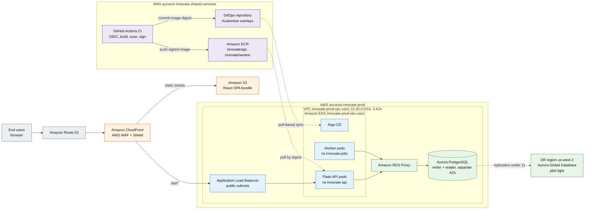

## High-Level Diagram (HLD)

This High-Level Diagram (HLD) is the whole system on one page, organised by tier rather than by AWS
service — start with the three coloured tiers, then trace one request left to right. Presentation
(orange) sits entirely at the edge; application (blue) runs on Amazon EKS behind one load balancer;
data (green) is reached only through Amazon RDS Proxy. Delivery (purple) builds and signs images in
a separate account, then reaches the cluster only through Argo CD's pull-based sync.

**Legend**

| Element | Meaning |
|---|---|
| Orange (`edge`) | Presentation tier — CloudFront, AWS Web Application Firewall (WAF), the S3 origin |
| Blue (`compute`) | Application tier — the load balancer, Argo CD, and the Flask API / worker pods on EKS |
| Green (`data`) | Data tier — RDS Proxy, Aurora PostgreSQL, and the disaster recovery (DR) region |
| Purple (`ops`) | Delivery pipeline — continuous integration (CI), ECR, and the GitOps repository |
| Grey (`external`) | Outside the system — end users and DNS resolution |

> **Note.** Non-production accounts, virtual private cloud (VPC) endpoints, EKS add-ons, and subnet
> detail are omitted here for legibility; see diagrams 2 and 3.
