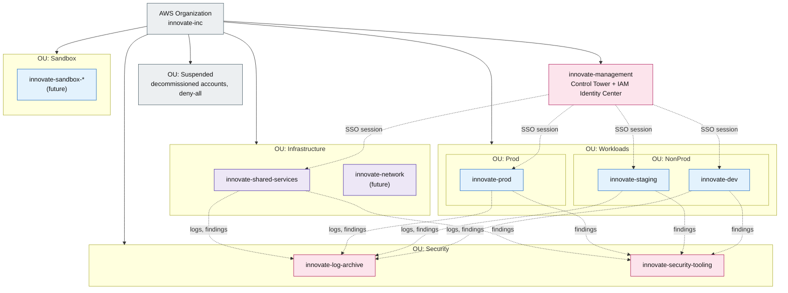

## Account and Organizational Unit Topology

Start at the root and follow the organizational units (OUs), not the account list — that is the
point of this diagram: service control policies (SCPs) attach to the OU, so moving an account between OUs
is how its guardrails change. Dashed edges show identity sessions and log or finding delivery, never
a network path; no account can reach another over the network. Two accounts, marked (future), arrive
as the team and its network topology grow.

**Legend**

| Element | Meaning |
|---|---|
| Pink (`security`) | Management and security accounts — govern and audit, no workloads |
| Purple (`ops`) | Infrastructure accounts — shared services, later the network account |
| Blue (`compute`) | Workload accounts — dev, staging, prod, future per-engineer sandboxes |
| Grey (`external`) | The organization root and the Suspended OU exit path |
| Dashed edge | An identity session or log/finding delivery, not a network path |

> **Note.** Permission sets and the six SCP guardrail families are omitted; see §1 Cloud Environment
> Structure for the full list.
