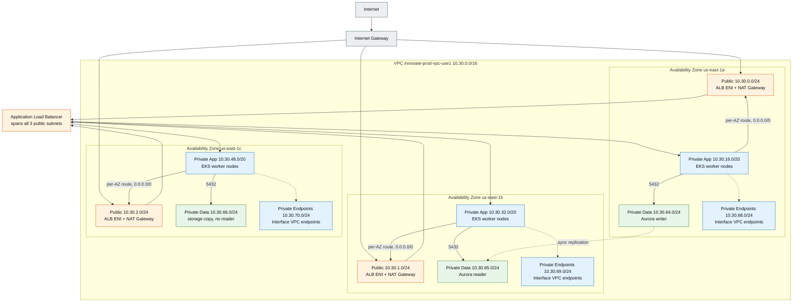

## Production Network Topology

Start with one Availability Zone (AZ) column, then see it repeat three times — that repetition is
the design. The four subnet tiers map one-to-one to the three application tiers: public for the edge
of the virtual private cloud (VPC), private-app for EKS nodes, private-data for Aurora,
private-endpoints for AWS service traffic kept off the NAT Gateway. Every Classless Inter-Domain
Routing (CIDR) block shown here matches the network design section exactly.

**Legend**

| Element | Meaning |
|---|---|
| Orange (`edge`) | Public subnet — the Application Load Balancer (ALB) and each AZ's NAT Gateway |
| Blue (`compute`) | Private App subnet — EKS worker nodes; also the interface VPC endpoints |
| Green (`data`) | Private Data subnet — Aurora writer, reader, and the third storage copy |
| Grey (`external`) | Outside the VPC — the internet and the Internet Gateway |

> **Note.** The pod CIDR (`100.66.0.0/16`), the reserved `/17` block, and security-group rules are
> omitted; see §2 Network Design for the full model.
