## CI/CD Pipeline and Progressive Delivery

Start with the colour, not the boxes: pink marks every point this continuous integration and
continuous delivery (CI/CD) pipeline can refuse a release between a commit and production traffic.
One commit's path runs through pull-request checks, a vulnerability scan, a Kyverno admission check,
integration tests in two environments, one human approval, and a two-step canary analysis that can
revert its own release without a human present.

```mermaid
flowchart LR
  dev["Developer<br/>git push"]
  pr["Pull request<br/>lint, tests, gitleaks, SAST, dependency audit, IaC scan"]
  merge["Merge to main"]
  build["Build, scan & sign<br/>buildx, SBOM, Trivy, cosign"]
  ecr["Amazon ECR<br/>push by digest"]
  gitops["GitOps commit<br/>image digest bump"]
  argocd["Argo CD<br/>pull-based sync"]
  kyverno["Kyverno admission check<br/>verifies signature + registry origin"]
  devenv["Dev environment<br/>auto-deploy"]
  itest["Integration tests<br/>dev"]
  stgenv["Staging environment<br/>production-shaped infra"]
  stgtest["Integration tests<br/>staging"]
  approval["Manual approval<br/>one reviewer minimum"]
  canary["Production canary<br/>Argo Rollouts: 10% → analysis → 50% → analysis → 100%"]
  prodfull["Production<br/>100% traffic"]
  rollback["Automatic rollback<br/>git revert of GitOps commit"]

  dev --> pr
  pr --> merge
  merge --> build
  build --> ecr
  ecr --> gitops
  gitops --> argocd
  argocd --> kyverno
  kyverno --> devenv
  devenv --> itest
  itest --> stgenv
  stgenv --> stgtest
  stgtest --> approval
  approval --> canary
  canary --> prodfull
  canary -.->|"SLO breach at either analysis gate"| rollback
  rollback -.->|"reverts"| gitops

  classDef security fill:#FCE4EC,stroke:#AD1457,stroke-width:1px,color:#111
  classDef ops fill:#EDE7F6,stroke:#4527A0,stroke-width:1px,color:#111
  classDef compute fill:#E3F2FD,stroke:#1565C0,stroke-width:1px,color:#111
  classDef external fill:#ECEFF1,stroke:#455A64,stroke-width:1px,color:#111
  class dev external
  class merge,ecr,gitops,argocd ops
  class devenv,stgenv,prodfull compute
  class pr,build,kyverno,itest,stgtest,approval,canary,rollback security
```

**Legend**

| Element | Meaning |
|---|---|
| Pink (`security`) | A refusal point — the release stops here if the check fails |
| Purple (`ops`) | Delivery pipeline mechanics — registry, GitOps commit, sync |
| Blue (`compute`) | A running environment receiving the deployed code |
| Grey (`external`) | The human developer initiating the change |
| Dashed edge | An automatic action outside the forward flow — rollback |

> **Note.** Argo CD and Kyverno run once per cluster (dev, staging, prod); shown once here as one
> generic promotion through all three.
