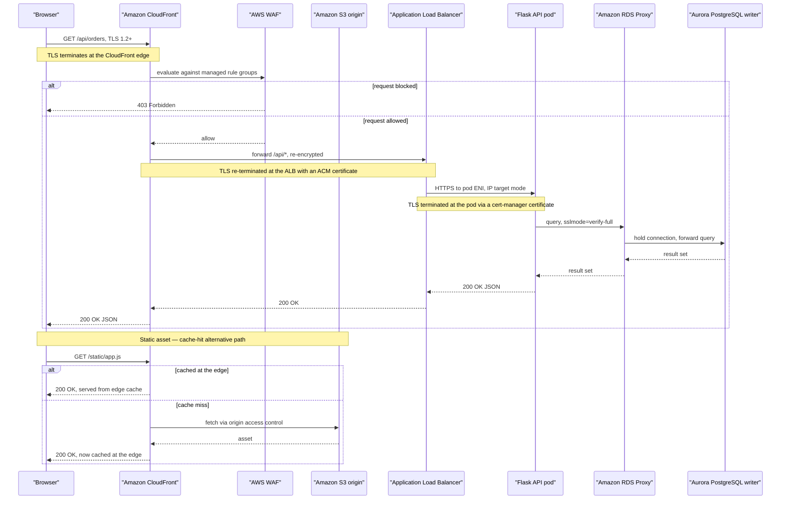

## Authenticated Request Flow

Start at the top and follow one authenticated request across all three tiers, past the AWS Web
Application Firewall (WAF) evaluation, then compare it to the second, shorter path below for a
cached static asset — proof the presentation tier answers without ever waking the application tier.
Every hop after CloudFront is still separately encrypted, with its own TLS termination point named
in a note.

**Legend**

| Element | Meaning |
|---|---|
| Solid arrow | A request — a synchronous call to the next hop |
| Dashed arrow | A response — the answer flowing back |
| `alt` / `else` block | A branch — the WAF verdict, or a cache hit versus a cache miss |
| `Note` | Where TLS terminates or re-terminates along the path |

> **Note.** Aurora's failover to the reader, and RDS Proxy's connection retention during it, are
> described in §4 Database and not repeated here.
